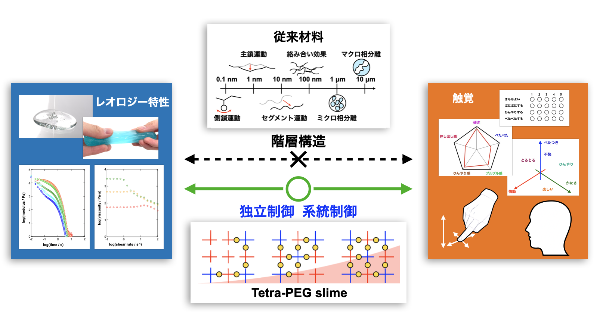

## 所属

東京大学大学院工学系研究科バイオエンジニアリング専攻 博士後期課程 (2026年度進学)

片島·鄭 研究室

## 研究

**○ ソフトマターのレオロジー特性と触覚認知の相関解明**

・人体や食品、化粧品などのソフトマター : 粘性と弾性の中間的な性質 **「レオロジー特性」**  
→ 「ぷにぷに」「べたべた」などの多様な触覚認知

・ソフトマターの触り心地は、材料の性質や触れる状況や触り方によって変化 
→ レオロジー特性と被験者の持つ文脈・背景が、触り方や触覚知覚・感性の評価に与える影響を調査する必要性 (商品開発や触覚認知の解明に寄与)

・ソフトマターは Å オーダーから μm オーダーまでの多階層構造をもち、その構造がレオロジー特性に影響 
→ 系統的に比較できる材料が制限 
→ 構造を制御できるモデル材料 [Tetra-PEG slime](https://doi.org/10.1016/j.progpolymsci.2025.102042) の利用

キーワード：レオロジー・サイコレオロジー・認知科学・高分子材料力学・ゲル・過渡的網目

## 連絡先

E-mail (Personal): rensato.ut@gmail.com

E-mail (University): sato-ren3100@g.ecc.u-toyko.ac.jp

## 関連リンク
- [Google Scholar](https://scholar.google.co.jp/citations?user=0wo5w1IAAAAJ&hl=ja&oi=ao)
- [Lab. information](https://rheo.tokyo/)